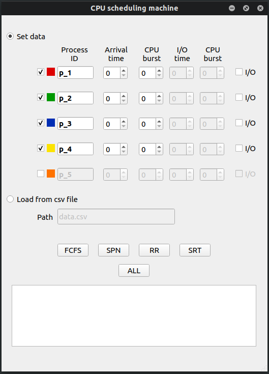
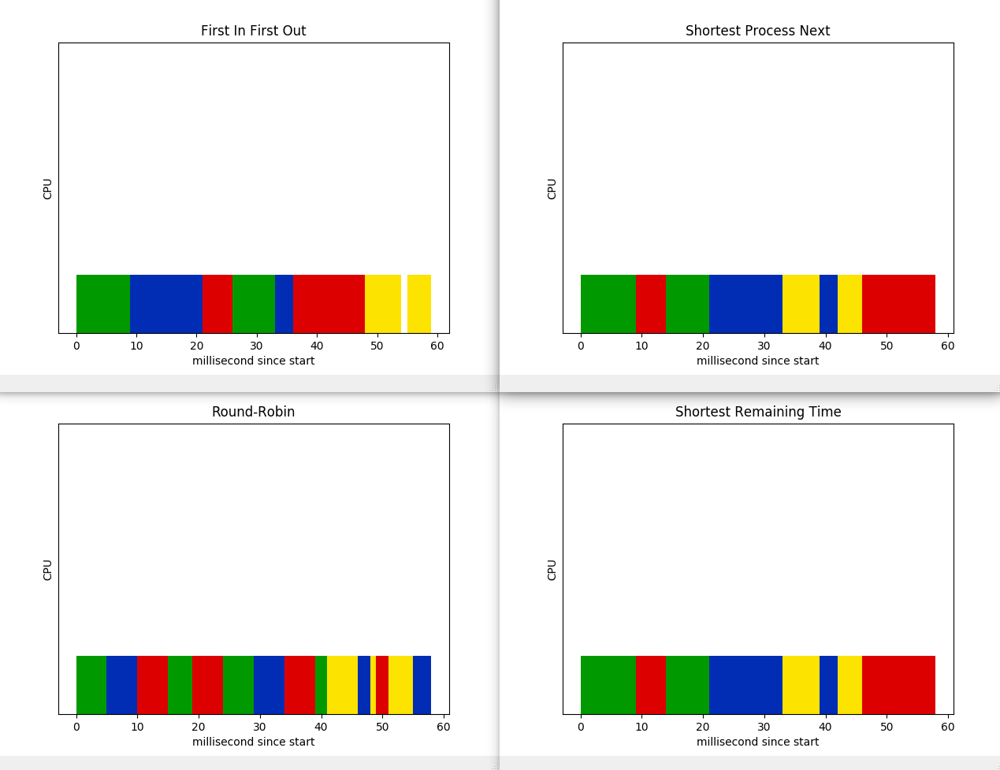

# CPU-scheduling-machine

### Get data from GUI and csv file

 
  

### Show Gantt chart of four algorithms

 
  

## Installation
- Clone and go to the project.
  - `git clone https://github.com/MiKoronjoo/CPU-scheduling-machine.git`
  - `cd CPU-scheduling-machine`
- Install the requirements.
  - `pip3 install -r requirements.txt`
- Run thr program.
  - `python3 ui.py`
  
